# Mi Proyecto de programacion Backend
## Comision 53150, CoderHouse

### Primera Entrega Proyecto usando Express de un e-commerce.

Se esta armando un proyecto en este momento se han creado el ProductManager y el CartsManagment en los cuales estan los metodos para el manejo de los productos y carritos. usando el Framework express se manejan los endpoint

Adjunto Imagenes de las pruebas realizadas:

>Primera Prueba:
 Desarrollar el servidor basado en Node.JS y 
express, que escuche en el puerto 8080 y 
disponga de dos grupos de rutas:

>$ node app.js
>
>Server Runing on Port: 8080

>/products y /carts. Dichos endpoints estarán implementados 
con el router de express, con las siguientes especificaciones

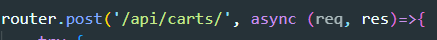

La ruta raíz GET / deberá listar todos los productos de la base. (Incluyendo la 
limitación ?limit del desafío anterior)

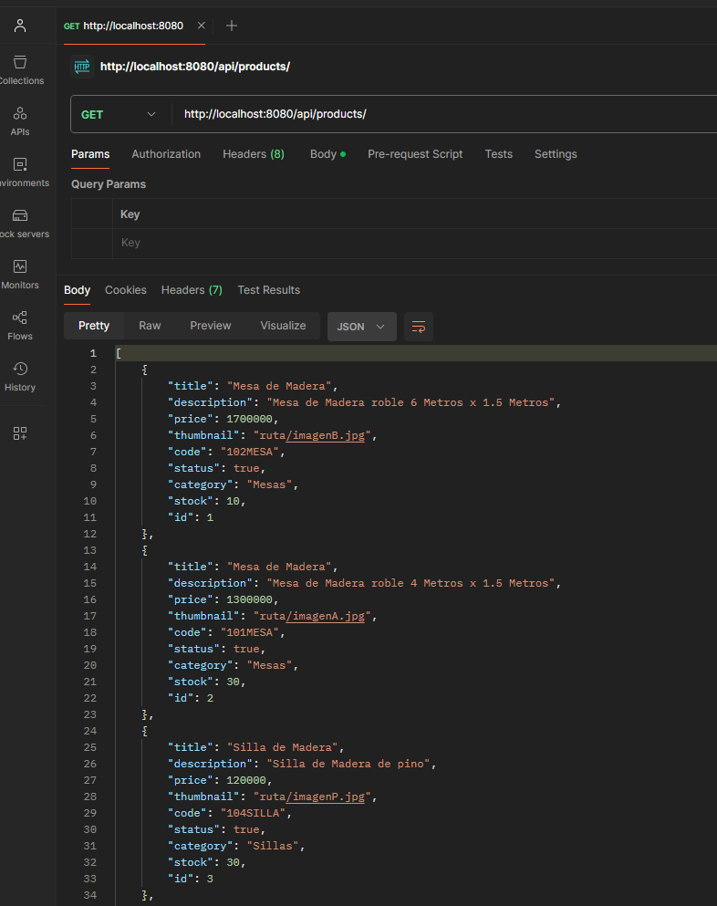

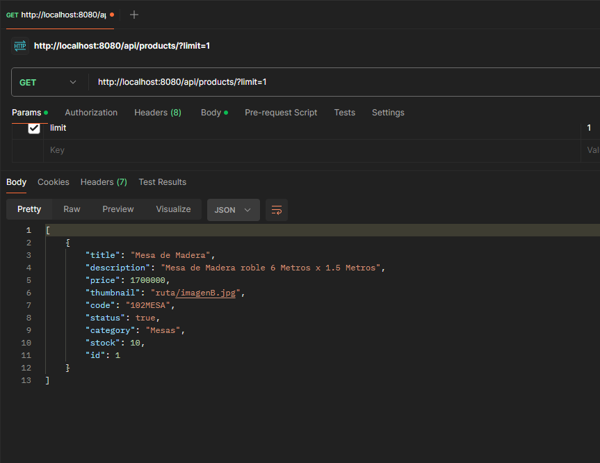

Si se ingresa un valor que no sea numerico en el ?limit= se mostrara todo el contenido de .json del producto

>La ruta GET /:pid deberá traer sólo el producto con el id proporcionado

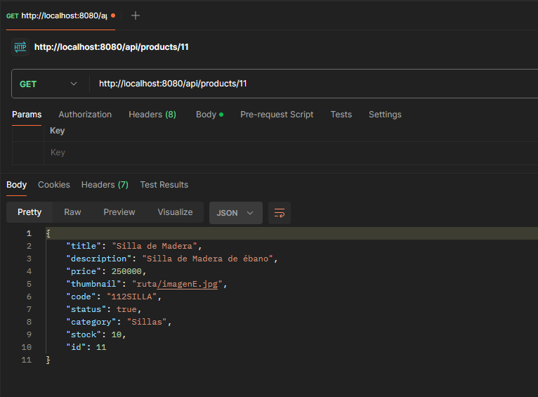

> La ruta raíz POST / deberá agregar un nuevo producto con los campos: id, title, description, price, thumbnail (no obligatorio), code, status ( por default true), category, stock.

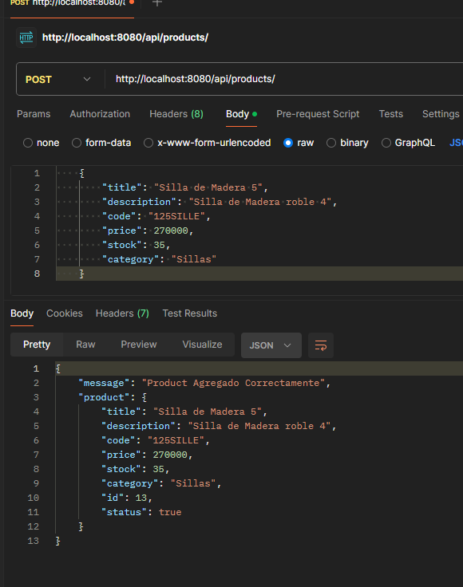

En esta captura se aprecia que no se pasa el status y se asigna por default ademas no tira error al no contener el campo thumbnail.

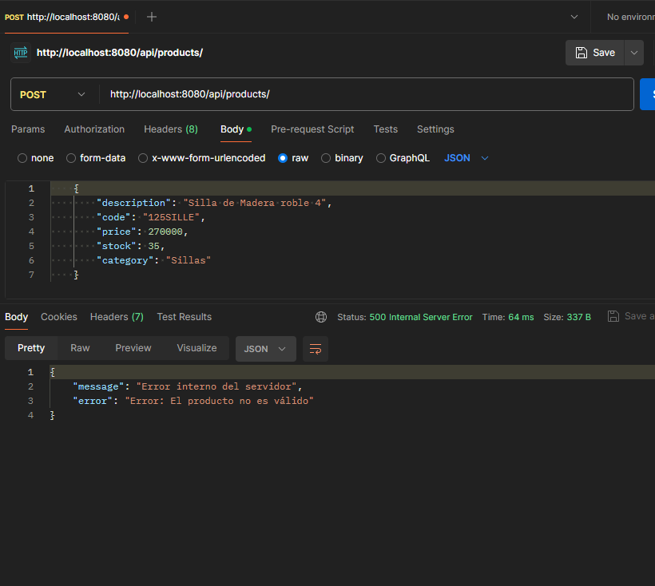

En esta imagen muestra el error Al querer agregar un producto sin por ejemplo title y muestra la leyenda de producto invalido y en la que sigue al querer cargar un producto con el mismo codigo:

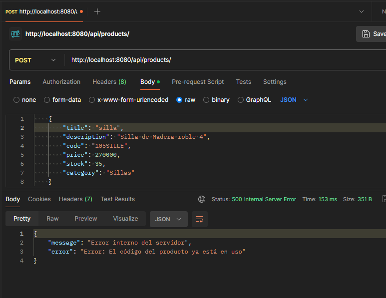

>La ruta PUT /:pid deberá tomar un producto y actualizarlo por los campos 
enviados desde body. NUNCA se debe actualizar o eliminar el id al momento de 
hacer dicha actualización.

Accion correcta:

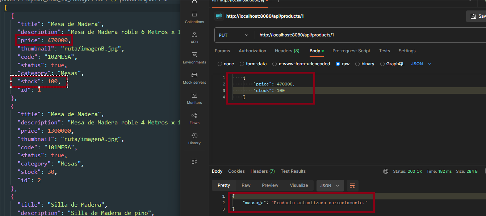

Falla por que ese producto no existe:

>La ruta DELETE /:pid deberá eliminar el producto con el pid indicado. 

Producto Eliminado correctamente:

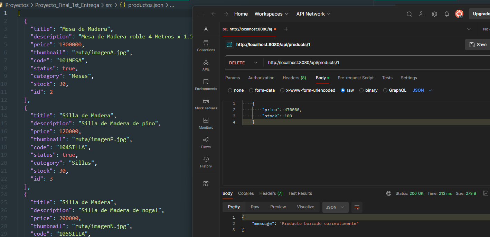

El producto que se quiso borrar no existe:

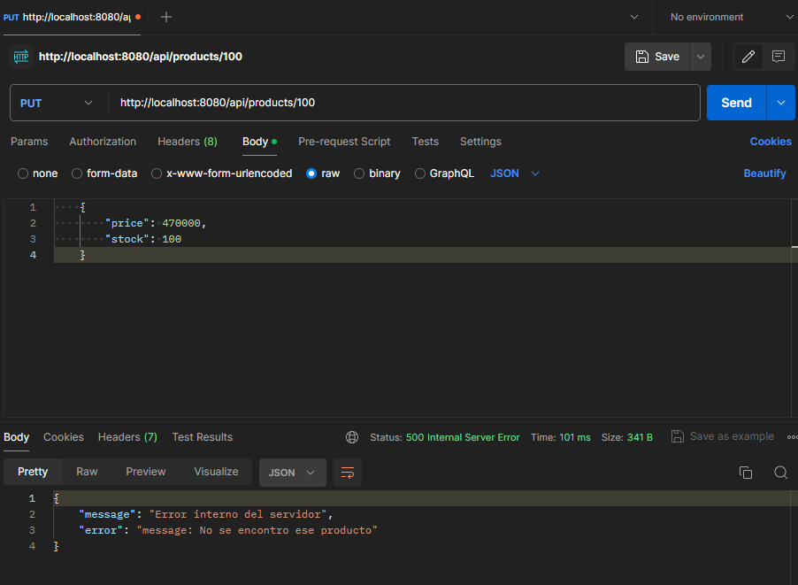

> La ruta raíz POST / deberá crear un nuevo carrito con la siguiente estructura:
Id:Number/String, products: Array de productos

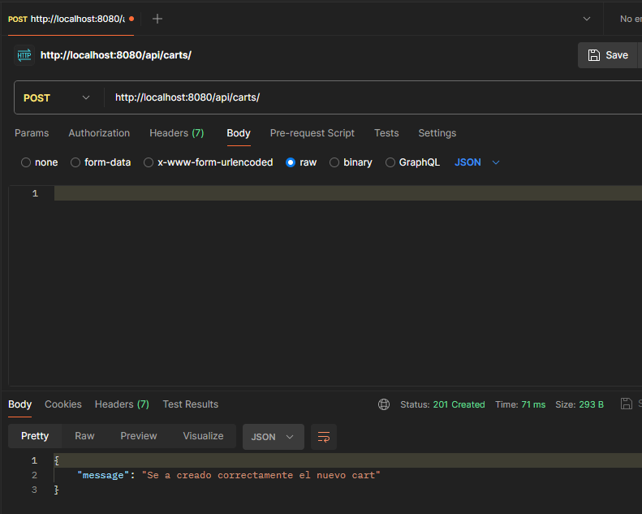

> La ruta GET /:cid deberá listar los productos que pertenezcan al carrito con el parámetro cid 

Caso exitoso:

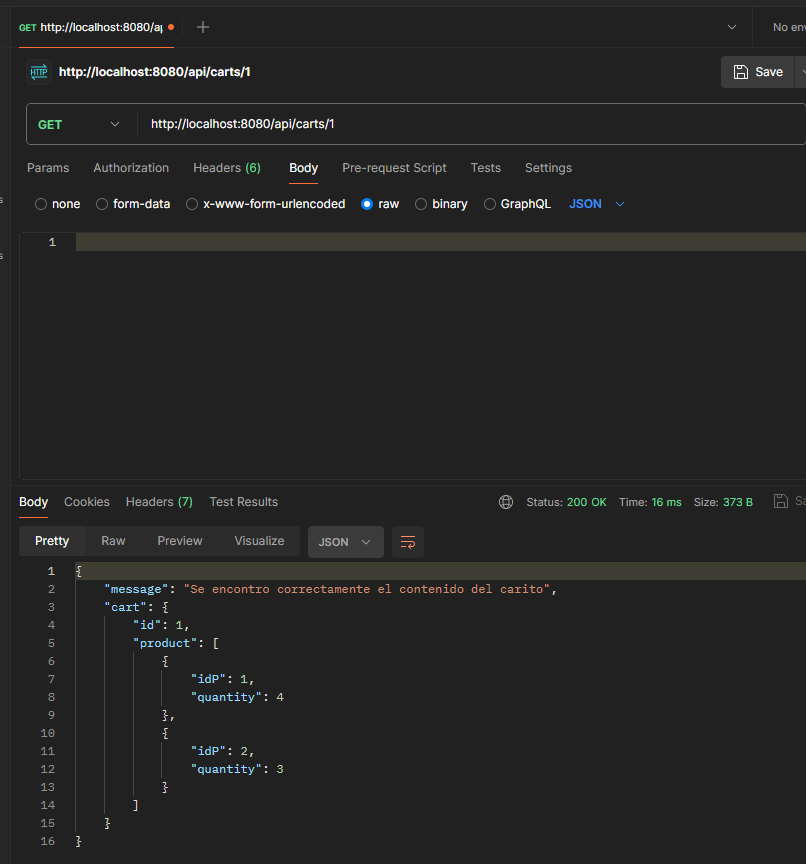

Si llamo un carts que no existe:

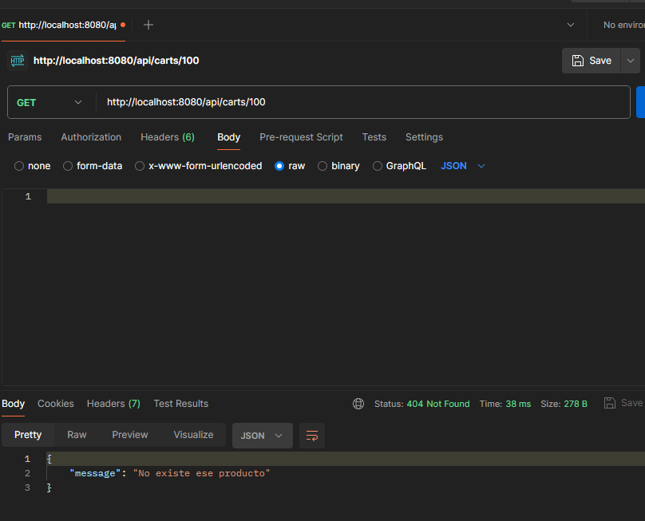

> La ruta POST  /:cid/product/:pid deberá agregar el producto al arreglo “products” del carrito seleccionado, agregándose como un objeto bajo el siguiente formato:
>
>product: SÓLO DEBE CONTENER EL ID DEL PRODUCTO (Es crucial que no agregues el producto completo). ///
>
>Quantity: debe contener el número de ejemplares de dicho producto. El producto, de momento, se agregará de uno en uno. 
> Además, si un producto ya existente intenta agregarse al producto, incrementar el campo 
quantity de dicho producto. 